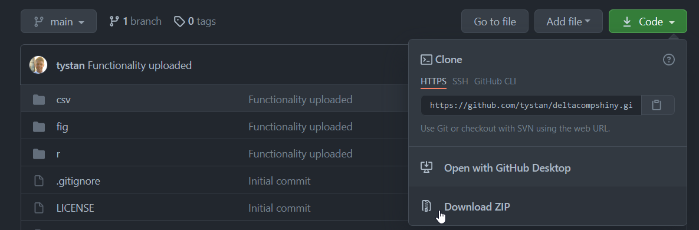
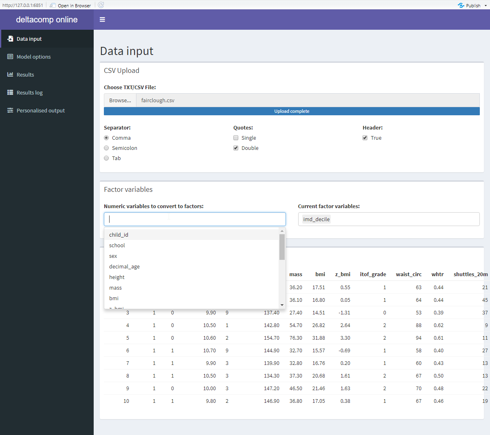
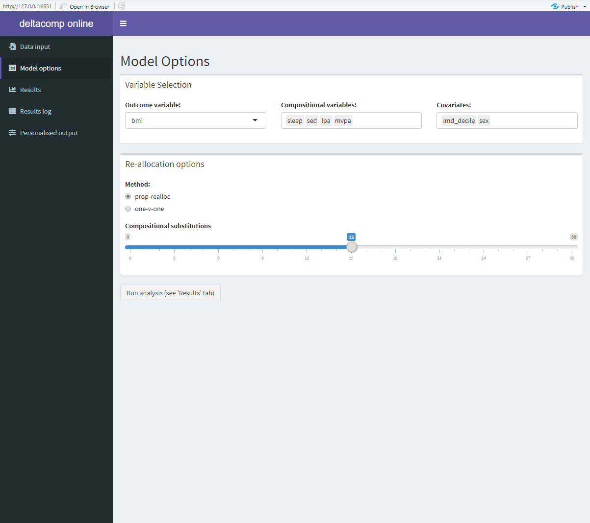
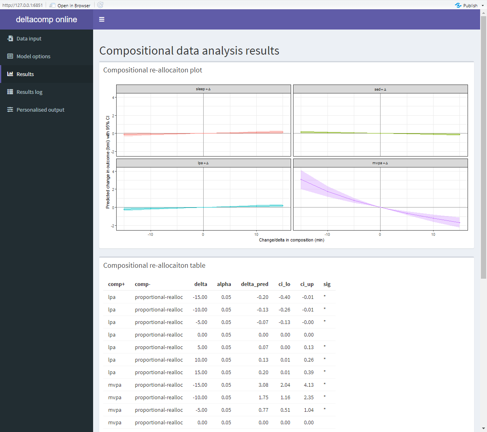
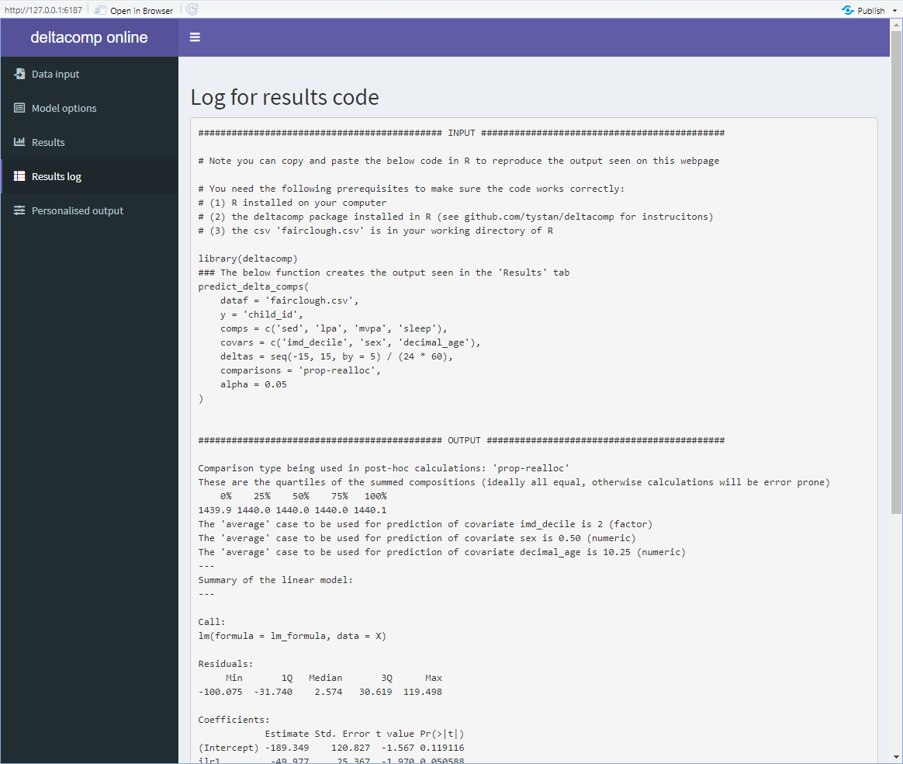

# deltacompshiny

An R Shiny App interface (web page) for the package deltacomp 


## Description

This is a Shiny App (interactive webpage) that allows the user to input a text file of compositional data (csv, tsv, txt files) and apply compositional data analysis via a point-and-click interface. 

This is to allow non R users to access the functionality contained in the [`deltacomp` package](https://github.com/tystan/deltacomp) by simply using a web interface.

## Using the Shiny App


The following steps will allow you to run the `deltacompshiny` Shiny App (above screenshot) on your own computer:

* Make sure you have [R](https://cran.r-project.org/) and [RStudio](https://www.rstudio.com/products/rstudio/download/) installed.
* Go to the `Code` button on the top right of this page and then click `Download zip` (see below screenshot).

* Unzip the download.
* Double click the `deltacompshiny.Rproj` file - this should open an RStudio session.
* (only has to be performed once) Follow the instructions on [this website](https://www.r-project.org/nosvn/pandoc/devtools.html) for installing the `devtools` package 
* (only has to be performed once) Make sure the prerequisite packages are installed by running the below command in the R console:
```r
install.packages(c("shiny", "shinydashboard"))
devtools::install_github('tystan/deltacomp')
```
* Now to finally run the Shiny App by running the below command in the R console:
```r
library(shiny)
runApp()
```

## Screenshots










